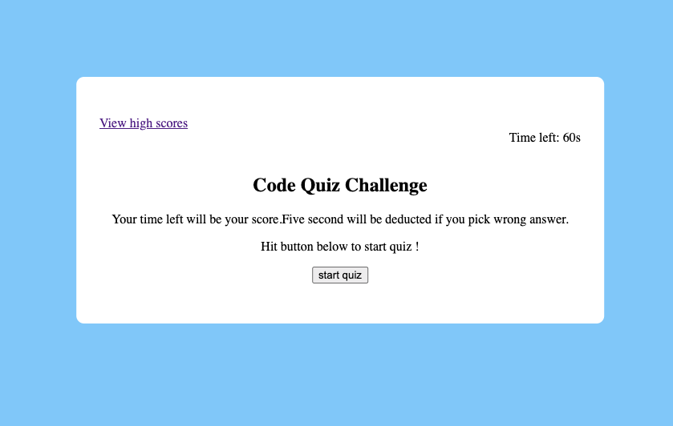
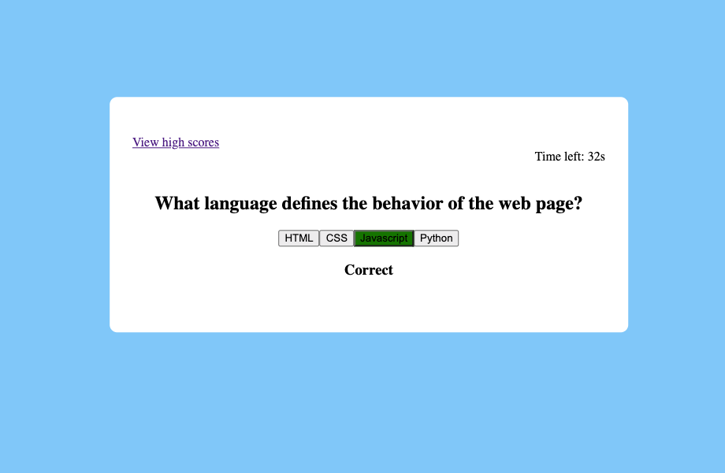
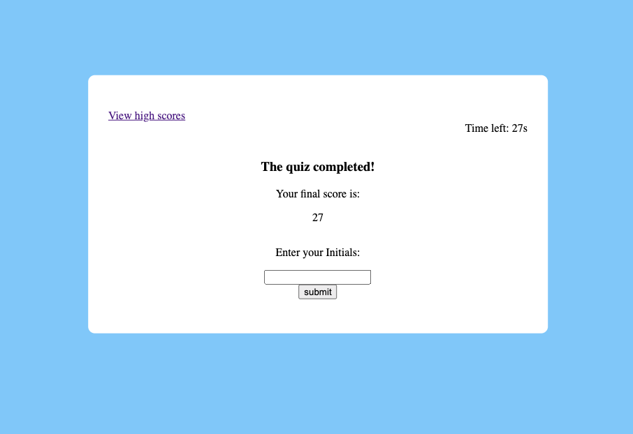
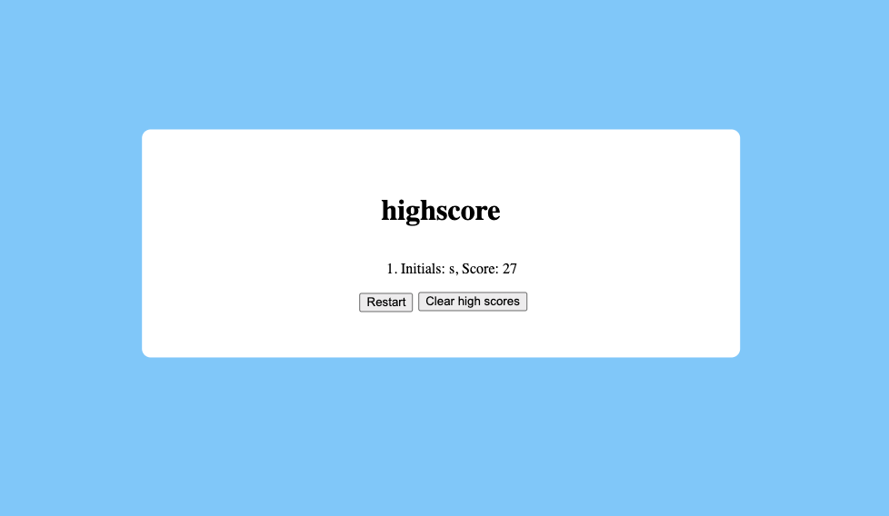

# code-quiz

# Github page
- https://shok1to.github.io/code-quiz/

# Repository
- https://github.com/Shok1to/code-quiz
# Description

- Created start button to start code quiz

- When the quiz starts,a timer starts

- Display question and answer

- Display correct and wrong answer by text and color

- When it is picked wrong answer,five second is deducted

- When all questions are answered or the timer reaches 0,the quiz end

- When the quiz is over,save Initial and high score

- Created clear high score and restart button
